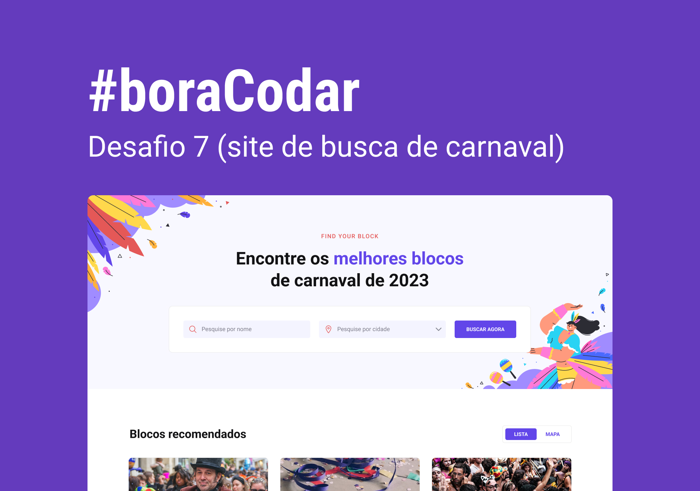

<h1>Bloco de  Carnaval  (Find your Block)</h1>

<h2 style="color:black "><strong>Desafio07 da Rocketseat do #boraCodar.</strong></h2>

- Feito com HTML e CSS puro.
Além de implementação de funcionalidades de em Javascript(ainda em construção).
   
- Utilizado tambem a responsividade como base, para que funcione desde um resolução mais alta até um mobile de forma clean, intuitiva e pratico. 

<a href="https://kauesiqueiraa.github.io/findyourblock/"><h2>Clique para acessar o projeto: kauesiqueiraa.github.io/findyourblock/</h2></a>

<h2>Resolução</h2>

